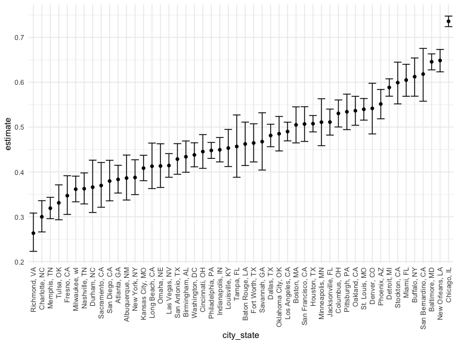
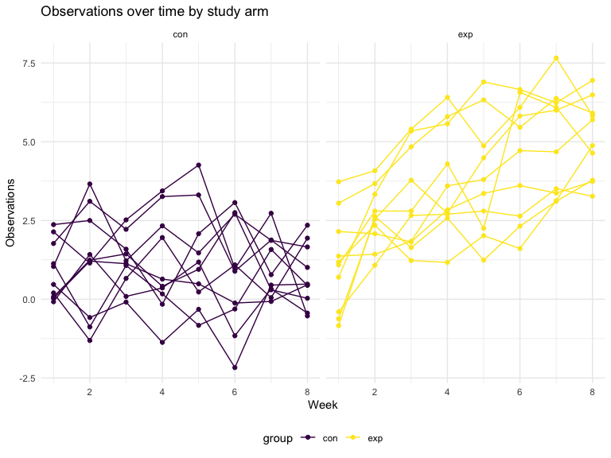

p8105\_hw5\_hr2479
================
Harry Reyes
11/16/2021

## Problem 1

The Washington Post has gathered data on homicides in 50 large U.S.
cities and made the data available through a GitHub repository
[here](https://github.com/washingtonpost/data-homicides). You can read
their accompanying article
[here](https://www.washingtonpost.com/graphics/2018/investigations/where-murders-go-unsolved/).

``` r
homicide = read_csv("data/homicide-data.csv")
```

    ## Rows: 52179 Columns: 12

    ## ── Column specification ────────────────────────────────────────────────────────
    ## Delimiter: ","
    ## chr (9): uid, victim_last, victim_first, victim_race, victim_age, victim_sex...
    ## dbl (3): reported_date, lat, lon

    ## 
    ## ℹ Use `spec()` to retrieve the full column specification for this data.
    ## ℹ Specify the column types or set `show_col_types = FALSE` to quiet this message.

Describe the raw data.

Create a `city_state` variable (e.g. “Baltimore, MD”) and then summarize
within cities to obtain the total number of homicides and the number of
unsolved homicides (those for which the disposition is “Closed without
arrest” or “Open/No arrest”).

``` r
homicide_df = 
  read_csv("./data/homicide-data.csv", na = c("", "Unknown")) %>%
  mutate(
    city_state = str_c(city,state),
    resolution = case_when(
      disposition == "Closed without arrest" ~ "unsolved",
      disposition == "Open/No arrest" ~ "unsolved",
      disposition == "Closed by arrest" ~ "solved"
    )) %>%
  relocate(city_state) %>%
  filter(city_state != "TulsaAL")
```

    ## Rows: 52179 Columns: 12

    ## ── Column specification ────────────────────────────────────────────────────────
    ## Delimiter: ","
    ## chr (8): uid, victim_last, victim_first, victim_race, victim_sex, city, stat...
    ## dbl (4): reported_date, victim_age, lat, lon

    ## 
    ## ℹ Use `spec()` to retrieve the full column specification for this data.
    ## ℹ Specify the column types or set `show_col_types = FALSE` to quiet this message.

For the city of Baltimore, MD, use the `prop.test` function to estimate
the proportion of homicides that are unsolved; save the output of
`prop.test` as an R object, apply the `broom::tidy` to this object and
pull the estimated proportion and confidence intervals from the
resulting tidy dataframe.

``` r
baltimore_df = 
  homicide_df %>% 
  filter(city_state == "BaltimoreMD") 

baltimore_summary =
  baltimore_df %>%
  summarize(
    unsolved = sum(resolution == "unsolved"),
    n=n()
  )

baltimore_test = 
  prop.test(
    x = baltimore_summary %>%  pull(unsolved), 
    n = baltimore_summary %>%  pull(n))

baltimore_test %>% 
  broom::tidy()%>%
  select(estimate, starts_with("conf"))
```

    ## # A tibble: 1 × 3
    ##   estimate conf.low conf.high
    ##      <dbl>    <dbl>     <dbl>
    ## 1    0.646    0.628     0.663

Now run `prop.test` for each of the cities in your dataset, and extract
both the proportion of unsolved homicides and the confidence interval
for each. Do this within a “tidy” pipeline, making use of `purrr::map`,
`purrr::map2`, list columns and `unnest` as necessary to create a tidy
dataframe with estimated proportions and CIs for each city.

``` r
prop_test_function = function(city_df){
  
  city_summary = 
    city_df %>% 
    summarize(
      unsolved = sum(resolution == "unsolved"),
      n = n()
      )
  
  city_test =
    prop.test(
      x = city_summary %>% pull(unsolved),
      n = city_summary %>% pull(n))
  
  return(city_test)
}
 
result_df = 
  homicide_df %>%
  nest(data = uid:resolution) %>%
  mutate(
    test_results = map(data, prop_test_function),
    tidy_results = map(test_results, broom::tidy)
  ) %>%
  select(city_state, tidy_results) %>%
  unnest(tidy_results) %>%
  select(city_state, estimate, starts_with("conf"))
```

Create a plot that shows the estimates and CIs for each city – check out
`geom_errorbar` for a way to add error bars based on the upper and lower
limits. Organize cities according to the proportion of unsolved
homicides.

``` r
result_df %>%
  mutate(
    city_state = fct_reorder(city_state, estimate)
    ) %>%
  ggplot(aes(x = city_state, y = estimate)) +
  geom_point() +
  geom_errorbar(aes(ymin = conf.low, ymax = conf.high)) +
  theme(axis.text.x = element_text(angle = 90, vjust = 0.5, hjust = 1))
```



## Problem 2

This [zip file](https://www.p8105.com/data/hw5_data.zip) contains data
from a longitudinal study that included a control arm and an
experimental arm. Data for each participant is included in a separate
file, and file names include the subject ID and arm.

Create a tidy dataframe containing data from all participants, including
the subject ID, arm, and observations over time:

-   Start with a dataframe containing all file names; the `list.files`
    function will help
-   Iterate over file names and read in data for each subject using
    `purrr::map` and saving the result as a new variable in the
    dataframe
-   Tidy the result; manipulate file names to include control arm and
    subject ID, make sure weekly observations are “tidy”, and do any
    other tidying that’s necessary.

``` r
longitudinal_df =
  tibble(
    files = list.files("./data/zip_data/"),
    path = str_c("data/zip_data/", files)
    ) %>% 
  mutate(data = purrr::map(path, read_csv, show_col_types = FALSE)) %>% 
  unnest(data) %>% 
  mutate(
    files = str_replace(files, ".csv", ""),
    arm = str_sub(files, 1, 3)) %>% 
  pivot_longer(
    week_1:week_8,
    names_to = "week",
    values_to = "observation",
    names_prefix = "week_") %>% 
  mutate(week = as.numeric(week),
         subject_id = files
         ) %>% 
  select(arm, subject_id, week, observation)
```

-   Make a spaghetti plot showing observations on each subject over
    time, and comment on differences between groups

``` r
arm.labs <- c("Control Arm", "Experimental Arm")
names(arm.labs) <- c("con", "exp")

spaghetti_plot = 
  longitudinal_df %>% 
  ggplot(aes(x = week, y = observation, group = subject_id, color = arm)) + 
  geom_line() + 
  geom_point() + 
  facet_grid(~arm,  labeller = labeller(arm = arm.labs)) +
  labs(
      x = "Week", 
      y = "Observations",
      title = "Observations on each subject over time by study arm") +
  theme(plot.title = element_text(hjust = 0.5))

spaghetti_plot
```



## Problem 3

The code chunk below loads the `iris` dataset from the `tidyverse`
package and introduces some missing values in each column. The purpose
of this problem is to fill in those missing values.

There are two cases to address:

-   For numeric variables, you should fill in missing values with the
    mean of non-missing values
-   For character variables, you should fill in missing values with
    `"virginica"`

Write a function that takes a vector as an argument; replaces missing
values using the rules defined above; and returns the resulting vector.
Apply this function to the columns of `iris_with_missing` using a `map`
statement.

``` r
set.seed(10)
iris_with_missing = 
  iris %>% 
  map_df(~replace(.x, sample(1:150, 20), NA)) %>%
  mutate(Species = as.character(Species))

iris_with_missing
```

    ## # A tibble: 150 × 5
    ##    Sepal.Length Sepal.Width Petal.Length Petal.Width Species
    ##           <dbl>       <dbl>        <dbl>       <dbl> <chr>  
    ##  1          5.1         3.5          1.4         0.2 setosa 
    ##  2          4.9         3            1.4         0.2 setosa 
    ##  3          4.7         3.2          1.3         0.2 setosa 
    ##  4          4.6         3.1          1.5        NA   setosa 
    ##  5          5           3.6          1.4         0.2 setosa 
    ##  6          5.4         3.9          1.7         0.4 setosa 
    ##  7         NA           3.4          1.4         0.3 setosa 
    ##  8          5           3.4          1.5         0.2 setosa 
    ##  9          4.4         2.9          1.4         0.2 setosa 
    ## 10          4.9         3.1         NA           0.1 setosa 
    ## # … with 140 more rows

``` r
replace_missing = function(x) {
  
  if (is_numeric(x)) {
    mean_nonmissing = round(mean(x, na.rm = TRUE, 1))
    x = replace_na(x, mean_nonmissing)}
  
  else if (is.character(x)) {
    x = replace_na(x, "virginica")}

  return(x)
}

iris_fill =  map_df(iris_with_missing, replace_missing)

iris_fill
```

    ## # A tibble: 150 × 5
    ##    Sepal.Length Sepal.Width Petal.Length Petal.Width Species
    ##           <dbl>       <dbl>        <dbl>       <dbl> <chr>  
    ##  1          5.1         3.5          1.4         0.2 setosa 
    ##  2          4.9         3            1.4         0.2 setosa 
    ##  3          4.7         3.2          1.3         0.2 setosa 
    ##  4          4.6         3.1          1.5         1   setosa 
    ##  5          5           3.6          1.4         0.2 setosa 
    ##  6          5.4         3.9          1.7         0.4 setosa 
    ##  7          6           3.4          1.4         0.3 setosa 
    ##  8          5           3.4          1.5         0.2 setosa 
    ##  9          4.4         2.9          1.4         0.2 setosa 
    ## 10          4.9         3.1          4           0.1 setosa 
    ## # … with 140 more rows
