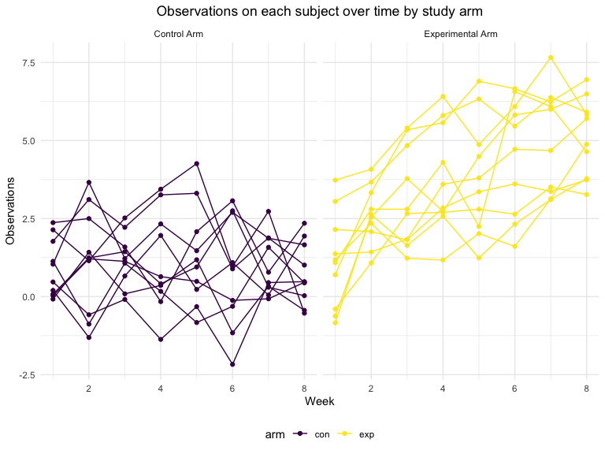

p8105\_hw5\_hr2479
================
Harry Reyes
11/16/2021

## Problem 1

The Washington Post made data on homicides in 50 U.S. cities publicly
available via a [Github
repository](https://github.com/washingtonpost/data-homicides). After
downloading the data, here we import and review the dataset.

``` r
homicide_df = 
  read_csv("./data/homicide-data.csv", na = c("", "Unknown"), show_col_types = FALSE) %>%
  mutate(
    city_state = str_c(city, state, sep = ", "),
    victim_age = as.numeric(victim_age),
    resolution = case_when(
      disposition == "Closed without arrest" ~ "unsolved",
      disposition == "Open/No arrest" ~ "unsolved",
      disposition == "Closed by arrest" ~ "solved"
    )) %>%
  relocate(city_state) %>%
  filter(city_state != "Tulsa, AL") 

head(homicide_df)%>%
  knitr::kable()
```

| city\_state     | uid        | reported\_date | victim\_last | victim\_first | victim\_race | victim\_age | victim\_sex | city        | state |      lat |       lon | disposition           | resolution |
|:----------------|:-----------|---------------:|:-------------|:--------------|:-------------|------------:|:------------|:------------|:------|---------:|----------:|:----------------------|:-----------|
| Albuquerque, NM | Alb-000001 |       20100504 | GARCIA       | JUAN          | Hispanic     |          78 | Male        | Albuquerque | NM    | 35.09579 | -106.5386 | Closed without arrest | unsolved   |
| Albuquerque, NM | Alb-000002 |       20100216 | MONTOYA      | CAMERON       | Hispanic     |          17 | Male        | Albuquerque | NM    | 35.05681 | -106.7153 | Closed by arrest      | solved     |
| Albuquerque, NM | Alb-000003 |       20100601 | SATTERFIELD  | VIVIANA       | White        |          15 | Female      | Albuquerque | NM    | 35.08609 | -106.6956 | Closed without arrest | unsolved   |
| Albuquerque, NM | Alb-000004 |       20100101 | MENDIOLA     | CARLOS        | Hispanic     |          32 | Male        | Albuquerque | NM    | 35.07849 | -106.5561 | Closed by arrest      | solved     |
| Albuquerque, NM | Alb-000005 |       20100102 | MULA         | VIVIAN        | White        |          72 | Female      | Albuquerque | NM    | 35.13036 | -106.5810 | Closed without arrest | unsolved   |
| Albuquerque, NM | Alb-000006 |       20100126 | BOOK         | GERALDINE     | White        |          91 | Female      | Albuquerque | NM    | 35.15111 | -106.5378 | Open/No arrest        | unsolved   |

The homicide dataset contains 52178 observations and 14 variables,
including the victim’s name, age, race (i.e., Asian, Black, Hispanic,
Other, White), and sex (i.e., Female, Male). There is also information
on the date the homicide was reported, its disposition (i.e., Closed by
arrest, Closed without arrest, Open/No arrest), the city and state of
the homicide, and its latitude and longitude. Homicide victims in this
dataset had a mean age of 32 years. As part of tidying this dataset, I
created a city\_state variable that combines city and state, and a
resolution variable based on the disposition of the case. I also dropped
an observation attributed to Tulsa, AL that appears to be an error.

Here I computed the total number of homicides and the number of unsolved
homicides (those for which the disposition is “Closed without arrest” or
“Open/No arrest”) at the city level.

``` r
citystate_homicide_df = 
  homicide_df %>% 
  select(city_state, disposition, resolution) %>% 
  group_by(city_state) %>% 
  summarize(homicides_total = n(),
            homicides_unsolved = sum(resolution == "unsolved"))

citystate_homicide_df%>%
  knitr::kable()
```

| city\_state        | homicides\_total | homicides\_unsolved |
|:-------------------|-----------------:|--------------------:|
| Albuquerque, NM    |              378 |                 146 |
| Atlanta, GA        |              973 |                 373 |
| Baltimore, MD      |             2827 |                1825 |
| Baton Rouge, LA    |              424 |                 196 |
| Birmingham, AL     |              800 |                 347 |
| Boston, MA         |              614 |                 310 |
| Buffalo, NY        |              521 |                 319 |
| Charlotte, NC      |              687 |                 206 |
| Chicago, IL        |             5535 |                4073 |
| Cincinnati, OH     |              694 |                 309 |
| Columbus, OH       |             1084 |                 575 |
| Dallas, TX         |             1567 |                 754 |
| Denver, CO         |              312 |                 169 |
| Detroit, MI        |             2519 |                1482 |
| Durham, NC         |              276 |                 101 |
| Fort Worth, TX     |              549 |                 255 |
| Fresno, CA         |              487 |                 169 |
| Houston, TX        |             2942 |                1493 |
| Indianapolis, IN   |             1322 |                 594 |
| Jacksonville, FL   |             1168 |                 597 |
| Kansas City, MO    |             1190 |                 486 |
| Las Vegas, NV      |             1381 |                 572 |
| Long Beach, CA     |              378 |                 156 |
| Los Angeles, CA    |             2257 |                1106 |
| Louisville, KY     |              576 |                 261 |
| Memphis, TN        |             1514 |                 483 |
| Miami, FL          |              744 |                 450 |
| Milwaukee, wI      |             1115 |                 403 |
| Minneapolis, MN    |              366 |                 187 |
| Nashville, TN      |              767 |                 278 |
| New Orleans, LA    |             1434 |                 930 |
| New York, NY       |              627 |                 243 |
| Oakland, CA        |              947 |                 508 |
| Oklahoma City, OK  |              672 |                 326 |
| Omaha, NE          |              409 |                 169 |
| Philadelphia, PA   |             3037 |                1360 |
| Phoenix, AZ        |              914 |                 504 |
| Pittsburgh, PA     |              631 |                 337 |
| Richmond, VA       |              429 |                 113 |
| Sacramento, CA     |              376 |                 139 |
| San Antonio, TX    |              833 |                 357 |
| San Bernardino, CA |              275 |                 170 |
| San Diego, CA      |              461 |                 175 |
| San Francisco, CA  |              663 |                 336 |
| Savannah, GA       |              246 |                 115 |
| St. Louis, MO      |             1677 |                 905 |
| Stockton, CA       |              444 |                 266 |
| Tampa, FL          |              208 |                  95 |
| Tulsa, OK          |              583 |                 193 |
| Washington, DC     |             1345 |                 589 |

Here, for the city of Baltimore, MD, I estimated the proportion (and
confidence intervals) of homicides that are unsolved. It appears to be
approximately 65% (95% CI: 63%-66%).

``` r
baltimore_df = 
  homicide_df %>% 
  filter(city_state == "Baltimore, MD") 

baltimore_summary =
  baltimore_df %>%
  summarize(
    unsolved = sum(resolution == "unsolved"),
    n=n()
  )

baltimore_test = 
  prop.test(
    x = baltimore_summary %>%  pull(unsolved), 
    n = baltimore_summary %>%  pull(n))

baltimore_test %>% 
  broom::tidy()%>%
  select(estimate, starts_with("conf"))%>%
  knitr::kable()
```

|  estimate |  conf.low | conf.high |
|----------:|----------:|----------:|
| 0.6455607 | 0.6275625 | 0.6631599 |

After developing my approach for a single city, I then created a
function that would similarly estimate the proportion (and confidence
intervals) of homicides that are unsolved for each city in the dataset.

``` r
prop_test_function = function(city_df){
  
  city_summary = 
    city_df %>% 
    summarize(
      unsolved = sum(resolution == "unsolved"),
      n = n()
      )
  
  city_test =
    prop.test(
      x = city_summary %>% pull(unsolved),
      n = city_summary %>% pull(n))
  
  return(city_test)
}
 
result_df = 
  homicide_df %>%
  nest(data = uid:resolution) %>%
  mutate(
    test_results = map(data, prop_test_function),
    tidy_results = map(test_results, broom::tidy)
  ) %>%
  select(city_state, tidy_results) %>%
  unnest(tidy_results) %>%
  select(city_state, estimate, starts_with("conf"))

result_df%>%
  knitr::kable()
```

| city\_state        |  estimate |  conf.low | conf.high |
|:-------------------|----------:|----------:|----------:|
| Albuquerque, NM    | 0.3862434 | 0.3372604 | 0.4375766 |
| Atlanta, GA        | 0.3833505 | 0.3528119 | 0.4148219 |
| Baltimore, MD      | 0.6455607 | 0.6275625 | 0.6631599 |
| Baton Rouge, LA    | 0.4622642 | 0.4141987 | 0.5110240 |
| Birmingham, AL     | 0.4337500 | 0.3991889 | 0.4689557 |
| Boston, MA         | 0.5048860 | 0.4646219 | 0.5450881 |
| Buffalo, NY        | 0.6122841 | 0.5687990 | 0.6540879 |
| Charlotte, NC      | 0.2998544 | 0.2660820 | 0.3358999 |
| Chicago, IL        | 0.7358627 | 0.7239959 | 0.7473998 |
| Cincinnati, OH     | 0.4452450 | 0.4079606 | 0.4831439 |
| Columbus, OH       | 0.5304428 | 0.5002167 | 0.5604506 |
| Dallas, TX         | 0.4811742 | 0.4561942 | 0.5062475 |
| Denver, CO         | 0.5416667 | 0.4846098 | 0.5976807 |
| Detroit, MI        | 0.5883287 | 0.5687903 | 0.6075953 |
| Durham, NC         | 0.3659420 | 0.3095874 | 0.4260936 |
| Fort Worth, TX     | 0.4644809 | 0.4222542 | 0.5072119 |
| Fresno, CA         | 0.3470226 | 0.3051013 | 0.3913963 |
| Houston, TX        | 0.5074779 | 0.4892447 | 0.5256914 |
| Indianapolis, IN   | 0.4493192 | 0.4223156 | 0.4766207 |
| Jacksonville, FL   | 0.5111301 | 0.4820460 | 0.5401402 |
| Kansas City, MO    | 0.4084034 | 0.3803996 | 0.4370054 |
| Las Vegas, NV      | 0.4141926 | 0.3881284 | 0.4407395 |
| Long Beach, CA     | 0.4126984 | 0.3629026 | 0.4642973 |
| Los Angeles, CA    | 0.4900310 | 0.4692208 | 0.5108754 |
| Louisville, KY     | 0.4531250 | 0.4120609 | 0.4948235 |
| Memphis, TN        | 0.3190225 | 0.2957047 | 0.3432691 |
| Miami, FL          | 0.6048387 | 0.5685783 | 0.6400015 |
| Milwaukee, wI      | 0.3614350 | 0.3333172 | 0.3905194 |
| Minneapolis, MN    | 0.5109290 | 0.4585150 | 0.5631099 |
| Nashville, TN      | 0.3624511 | 0.3285592 | 0.3977401 |
| New Orleans, LA    | 0.6485356 | 0.6231048 | 0.6731615 |
| New York, NY       | 0.3875598 | 0.3494421 | 0.4270755 |
| Oakland, CA        | 0.5364308 | 0.5040588 | 0.5685037 |
| Oklahoma City, OK  | 0.4851190 | 0.4467861 | 0.5236245 |
| Omaha, NE          | 0.4132029 | 0.3653146 | 0.4627477 |
| Philadelphia, PA   | 0.4478103 | 0.4300380 | 0.4657157 |
| Phoenix, AZ        | 0.5514223 | 0.5184825 | 0.5839244 |
| Pittsburgh, PA     | 0.5340729 | 0.4942706 | 0.5734545 |
| Richmond, VA       | 0.2634033 | 0.2228571 | 0.3082658 |
| San Antonio, TX    | 0.4285714 | 0.3947772 | 0.4630331 |
| Sacramento, CA     | 0.3696809 | 0.3211559 | 0.4209131 |
| Savannah, GA       | 0.4674797 | 0.4041252 | 0.5318665 |
| San Bernardino, CA | 0.6181818 | 0.5576628 | 0.6753422 |
| San Diego, CA      | 0.3796095 | 0.3354259 | 0.4258315 |
| San Francisco, CA  | 0.5067873 | 0.4680516 | 0.5454433 |
| St. Louis, MO      | 0.5396541 | 0.5154369 | 0.5636879 |
| Stockton, CA       | 0.5990991 | 0.5517145 | 0.6447418 |
| Tampa, FL          | 0.4567308 | 0.3881009 | 0.5269851 |
| Tulsa, OK          | 0.3310463 | 0.2932349 | 0.3711192 |
| Washington, DC     | 0.4379182 | 0.4112495 | 0.4649455 |

I also created a plot that shows the estimates and CIs for each city,
organizing cities according to the proportion of unsolved homicides.

``` r
result_df %>%
  mutate(
    city_state = fct_reorder(city_state, estimate)
    ) %>%
  ggplot(aes(x = city_state, y = estimate)) +
  geom_point() +
  geom_errorbar(aes(ymin = conf.low, ymax = conf.high)) +
  theme(axis.text.x = element_text(angle = 90, vjust = 0.5, hjust = 1))
```


## Problem 2

This [zip file](https://www.p8105.com/data/hw5_data.zip) contains data
from a longitudinal study that included a control arm and an
experimental arm. Data for each participant is included in a separate
file, and file names include the subject ID and arm.

Create a tidy dataframe containing data from all participants, including
the subject ID, arm, and observations over time:

-   Start with a dataframe containing all file names; the `list.files`
    function will help
-   Iterate over file names and read in data for each subject using
    `purrr::map` and saving the result as a new variable in the
    dataframe
-   Tidy the result; manipulate file names to include control arm and
    subject ID, make sure weekly observations are “tidy”, and do any
    other tidying that’s necessary.

``` r
longitudinal_df =
  tibble(
    files = list.files("./data/zip_data/"),
    path = str_c("data/zip_data/", files)
    ) %>% 
  mutate(data = purrr::map(path, read_csv, show_col_types = FALSE)) %>% 
  unnest(data) %>% 
  mutate(
    files = str_replace(files, ".csv", ""),
    arm = str_sub(files, 1, 3)) %>% 
  pivot_longer(
    week_1:week_8,
    names_to = "week",
    values_to = "observation",
    names_prefix = "week_") %>% 
  mutate(week = as.numeric(week),
         subject_id = files
         ) %>% 
  select(arm, subject_id, week, observation)
```

-   Make a spaghetti plot showing observations on each subject over
    time, and comment on differences between groups

``` r
arm.labs <- c("Control Arm", "Experimental Arm")
names(arm.labs) <- c("con", "exp")

spaghetti_plot = 
  longitudinal_df %>% 
  ggplot(aes(x = week, y = observation, group = subject_id, color = arm)) + 
  geom_line() + 
  geom_point() + 
  facet_grid(~arm,  labeller = labeller(arm = arm.labs)) +
  labs(
      x = "Week", 
      y = "Observations",
      title = "Observations on each subject over time by study arm") +
  theme(plot.title = element_text(hjust = 0.5))

spaghetti_plot
```



## Problem 3

The code chunk below loads the `iris` dataset from the `tidyverse`
package and introduces some missing values in each column. The purpose
of this problem is to fill in those missing values.

There are two cases to address:

-   For numeric variables, you should fill in missing values with the
    mean of non-missing values
-   For character variables, you should fill in missing values with
    `"virginica"`

Write a function that takes a vector as an argument; replaces missing
values using the rules defined above; and returns the resulting vector.
Apply this function to the columns of `iris_with_missing` using a `map`
statement.

``` r
set.seed(10)
iris_with_missing = 
  iris %>% 
  map_df(~replace(.x, sample(1:150, 20), NA)) %>%
  mutate(Species = as.character(Species))

iris_with_missing
```

    ## # A tibble: 150 × 5
    ##    Sepal.Length Sepal.Width Petal.Length Petal.Width Species
    ##           <dbl>       <dbl>        <dbl>       <dbl> <chr>  
    ##  1          5.1         3.5          1.4         0.2 setosa 
    ##  2          4.9         3            1.4         0.2 setosa 
    ##  3          4.7         3.2          1.3         0.2 setosa 
    ##  4          4.6         3.1          1.5        NA   setosa 
    ##  5          5           3.6          1.4         0.2 setosa 
    ##  6          5.4         3.9          1.7         0.4 setosa 
    ##  7         NA           3.4          1.4         0.3 setosa 
    ##  8          5           3.4          1.5         0.2 setosa 
    ##  9          4.4         2.9          1.4         0.2 setosa 
    ## 10          4.9         3.1         NA           0.1 setosa 
    ## # … with 140 more rows

``` r
replace_missing = function(x) {
  
  if (is_numeric(x)) {
    mean_nonmissing = round(mean(x, na.rm = TRUE, 1))
    x = replace_na(x, mean_nonmissing)}
  
  else if (is.character(x)) {
    x = replace_na(x, "virginica")}

  return(x)
}

iris_fill =  map_df(iris_with_missing, replace_missing)

iris_fill
```

    ## # A tibble: 150 × 5
    ##    Sepal.Length Sepal.Width Petal.Length Petal.Width Species
    ##           <dbl>       <dbl>        <dbl>       <dbl> <chr>  
    ##  1          5.1         3.5          1.4         0.2 setosa 
    ##  2          4.9         3            1.4         0.2 setosa 
    ##  3          4.7         3.2          1.3         0.2 setosa 
    ##  4          4.6         3.1          1.5         1   setosa 
    ##  5          5           3.6          1.4         0.2 setosa 
    ##  6          5.4         3.9          1.7         0.4 setosa 
    ##  7          6           3.4          1.4         0.3 setosa 
    ##  8          5           3.4          1.5         0.2 setosa 
    ##  9          4.4         2.9          1.4         0.2 setosa 
    ## 10          4.9         3.1          4           0.1 setosa 
    ## # … with 140 more rows
